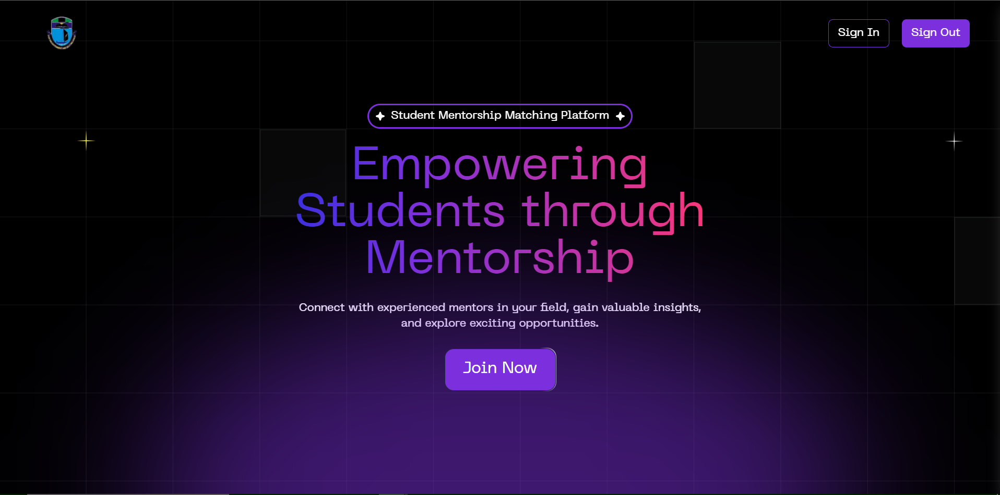

# GES400 Group 8 (Student Mentorship Matching Platform)

### Group Members:

[Lordson](https://github.com/lordson-silver) | [Michael]() | Daniel | Jerry | Tesimi | Godsgift

---

## Deployed on Vercel

This project is deployed on Vercel [`Click Here To Visit Project`](https://group8-xi.vercel.app/)



## Getting Started

First, run the development server:

```bash
npm run dev
# or
yarn dev
# or
pnpm dev
# or
bun dev
```

Open [http://localhost:3000](http://localhost:3000) with your browser to see the result.

This is a [Next.js](https://nextjs.org/) project bootstrapped with [`create-next-app`](https://github.com/vercel/next.js/tree/canary/packages/create-next-app).

This project uses [`Shadcn UI`](https://ui.shadcn.com/) Beautifully designed components that you can copy and paste into your apps. Accessible. Customizable. Open Source.

This project uses [`Acetermity UI`](https://ui.aceternity.com/) Copy paste the most trending components and use them in your websites without having to worry about styling and animations. Open Source.

This project uses [`Tailwind`](https://tailwindcss.com/) A utility-first CSS framework packed with classes like `flex`, `pt-4`, `text-center` and `rotate-90` that can be composed to build any design, directly in your markup.
